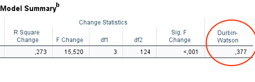
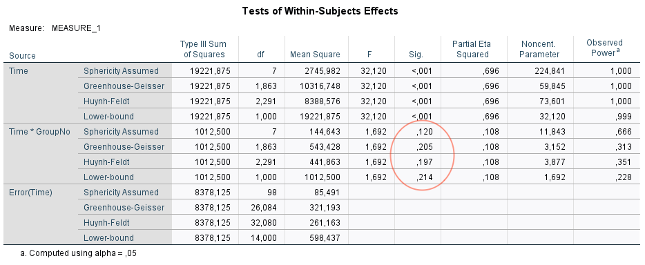

```{css, echo=FALSE}
pre {
  white-space: pre-wrap;
}
.pull-left {
  float: left;
  width: 35%;
}
.pull-right {
  float: right;
  width: 60%;
}
.pull-left-c {
  float: left;
  width: 47%;
}
.pull-right-c {
  float: right;
  width: 47%;
}
img, video, iframe {
  max-width: 100%;
  max-height: 80%;
}
.tiny .remark-code {
  font-size: 60% !important;
}

.teny .remark-code {
  font-size: 50% !important;
}
.tizy .remark-code {
  font-size: 45% !important;
}
.center2 {
  margin: 0;
  position: absolute;
  top: 50%;
  left: 50%;
  -ms-transform: translate(-50%, -50%);
  transform: translate(-50%, -50%);
}
```

```{r setup, include=FALSE}
# Set working directory
knitr::opts_knit$set(root.dir = '~/Projects/biostatistics-presentation')
setwd('~/Projects/biostatistics-presentation')

options(htmltools.dir.version = FALSE)

require(tidyverse)
require(broom)
require(ggfortify)
library("ggpubr")

data <- read_tsv("data/problem2_data.txt", col_names = c("Id", "Group", "Week", "Score"), col_types = "nfnn", skip = 1)

data <- data %>%
  mutate(Group = factor(Group, levels = c('Std', 'Exp')),
         Group = recode(Group, 
                        Std = "Standard",
                        Exp = "Experimental"))

data
```

# Research question 

<b>Objective:</b> Evaluation of  a new therapy program designed to help patients recover from stroke.

<b>Design:</b>
- Randomized trial comparing the new therapy to a standard program.
- Patients were evaluated at baseline (week 0) and once per week for 7 consecutive weeks with the Barthel index. The higher scores indicating a higher degree of independence.

---
# Barthel Index (BI)


---

# Data description

```{r, echo=FALSE, results=FALSE}
data_no_outlier <- data %>% filter(Id !=5)
```

.pull-left[

- 8 patients enrolled in each group
- Longitudinal data
- Fixed time interval (1 week) between measurements
- No missing data
- <b>BUT</b> one individual which has 100 across all data points..

]

<!-- Want to look at patients recovering from stroke, if a patient has 100 the patient is already fully (?) recovered at start and should not be included in this trial?  -->
.pull-right[
```{r, echo=FALSE, fig.width=6,fig.height=4, dev='png', dpi=300}
#data %>%
#  mutate(`Ìndividual (Id)`= factor(Id)) %>%
#  ggplot(aes(Week, Score, color = `Ìndividual (Id)`)) +
#  geom_line() +
#  facet_wrap(~Group) 

data_id_as_factor <- data %>% mutate(Id = factor(Id))
ggline(data_id_as_factor, x = "Week", y = "Score", color = "Id", shape = "Id") + facet_wrap(~Group) + theme(legend.position = "none")
```
]

---

# Statistical analysis

<!-- Which analysis method did you choose?  -->

We chose multiple linear regression (as prescribed by the exam)

But we try to understand why: ignore repeated measurements

For choosing the independent variables:
- Exp and Std groups
- Rime interval between the initiation of the treatment to the time point that you measure the BI score matters (the longer patients recover, the better they may get)


<i>Time is lurking under the surface</i>


<!-- Why? (This should be discussed even if the exam prescribes a certain analysis.)  -->

```{r, echo=FALSE, results=FALSE}
model <- lm(Score ~ Group + Week + Group : Week, data_no_outlier)
model_outlier <- lm(Score ~ Group + Week + Group : Week, data)
augment(model) %>% pull(.resid) %>% shapiro.test()
```

<!-- Explain why you think your chosen analysis is reasonable. -->

---

# Results

<!-- "Analyze the data using multiple linear regression with the following predictors: Group, week, and a group x week interaction term. How to include interaction terms depends on the statistical software." -->

<!-- When presenting your results, tell the audience which number(s) you consider most important, and what they mean. Interpret your results in ordinary language. -->

$Score = Group + Week + Group \times Week$

$y = \alpha + \beta_{g}x_{g} + \beta_{w}x_{w} + \beta_{gw}x_{g}x_{w}$

.pull-left[

- <b>Intercept:</b> the value of y if all the x's are 0 

- <b>Group:</b> Experimental estimated mean score 10.5 points lower than the standard group

- <b>Week:</b> Standard group score increases 4.33 per week

- <b>Interaction:</b> Experimental group score increases with 4.33 + 2.89 per week

]

.pull-right[
.tiny[
```{r, echo=FALSE}
summary(model)
```
]
]

<!-- You should get 4 estimated regression coefficients, including the intercept. What do they mean? Which one tells us most about the new program? Does it seem promising? -->

---

# Results

.pull-left[

### Estimated mean at week 0

- Standard: 37.5

- Experimental: 27

### Score increase per week

- Standard: 4.33

- Experimental: 7.22

]

.pull-right[
```{r, echo=FALSE, message=FALSE,fig.width=6,fig.height=4, dev='png', dpi=300}

#data_no_outlier %>%
#  ggplot(aes(Week, Score, color = Group)) + 
#  geom_point(position = position_jitterdodge(), #alpha = 0.5) +
#  stat_smooth(method = "lm", formula = y ~ x, se = #FALSE) +
#  ylim(0,100)

ggscatter(data_no_outlier, x = "Week", y = "Score", color = "Group", position = position_jitterdodge(), add = "reg.line", conf.int = TRUE, alpha = 0.3) + ylim(0,100)


#data %>%
#  ggplot(aes(Week, Score, color = Group)) + 
#  geom_point(position = position_jitterdodge(), alpha = 0.5) +
#  stat_smooth(method = "lm", formula = y ~ x, se = FALSE) +
#  ylim(0,100)

```
]

``` {r, eval=FALSE, echo=FALSE}
exp <- data_no_outlier %>%
  filter(Group == "Experimental (new)")

std <- data_no_outlier %>%
  filter(Group == "Standard")

lm(Score ~ Week, exp)
lm(Score ~ Week, std)

exp %>% filter(Week == 0) %>% summarize(mean(Score))
std %>% filter(Week == 0) %>% summarize(median(Score))
data %>% filter(Week == 0) %>% summarize(mean(Score))
```
---

# When including the outlier

.pull-left[
.tizy[
```{r}
summary(model_outlier)
```
]
]

.pull-right[
```{r, echo=FALSE, message=FALSE,fig.width=6,fig.height=4, dev='png', dpi=300}

#data_no_outlier %>%
#  ggplot(aes(Week, Score, color = Group)) + 
#  geom_point(position = position_jitterdodge(), #alpha = 0.5) +
#  stat_smooth(method = "lm", formula = y ~ x, se = #FALSE) +
#  ylim(0,100)

ggscatter(data, x = "Week", y = "Score", color = "Group", position = position_jitterdodge(), add = "reg.line", conf.int = TRUE, alpha = 0.3) + ylim(0,100)


#data %>%
#  ggplot(aes(Week, Score, color = Group)) + 
#  geom_point(position = position_jitterdodge(), alpha = 0.5) +
#  stat_smooth(method = "lm", formula = y ~ x, se = FALSE) +
#  ylim(0,100)

```
]

---

# Model assumptions: Normal residuals
.pull-left[

- The model assumes the residuals to be normally distributed 

- Check graphically or numerically 

- Shapiro-Wilk, W > 0.95 

]
.pull-right[
``` {r, echo=FALSE, fig.width=6,fig.height=3, dev='png', dpi=300, warning=FALSE}
# Checking model assumptions
#   - Checking normality
#     - The model assumes the residuals to be normal (not x or y)
#     - After computing these, normality can be checked
#         - Graphically, e.g. histogram, Q-Q plot
autoplot(model, data = data_no_outlier, colour = 'Group')[2] + theme_pubr()
#p1 <- augment(model) %>%
 # ggplot(aes(.resid)) + 
#  geom_histogram(binwidth = 5, position = "identity", alpha = 1)

#p1 <- gghistogram(augment(model), x = ".resid", fill = "grey")

#         - Q-Q plot

#p2 <- ggqqplot(augment(model)$.resid)

#ggarrange(p1,p2, ncol = 2, nrow = 1,
#          labels = c("Histogram", "Q-Q plot"))

#         - Numerically, e.g. the Shapiro-Wilk test.

augment(model) %>% pull(.resid) %>% shapiro.test()


```
]

???

Normality of residuals. The residual errors are assumed to be normally distributed.

---

# Model assumptions: Linearity & Homogeneity of residuals

.pull-left[

- Linear relationship between x and y

- Equal SD for the residuals

]

.pull-right[
```{r, echo=FALSE,fig.width=6,fig.height=4, dev='png', dpi=300}

autoplot(model, data = data_no_outlier, colour = 'Group')[c(1,3)] + theme_pubr()

```
]

???

Linearity of the data. The relationship between the predictor (x) and the outcome (y) is assumed to be linear.

Homogeneity of residuals variance. The residuals are assumed to have a constant variance (homoscedasticity). Homoscedasticity in a model means that the error is constant along the values of the dependent variable.

---

# Model assumptions: Independent measurements 

> "Bonus question: The assumption of <b>independent measurements is violated</b> in this example [...]"

### Why? 

 <!-- "Why? Is this a serious problem? Can you think of an alternative analysis that overcomes this problem? What results does it give?" -->

- Same individual measured at 8 time points (week 0-7)

- Autocorrelation/serial correlation

Serial correlation can be assessed with the Durbin-Watson test; 2=no correlation, below 2=positive correlation, above 2=negative correlation



```{r, comment="#", eval=FALSE, echo=FALSE}
# Model assumptions
# "The exact formulation of the linear regression model is:
#   - Linear relationship between x and y

# > cor(data_no_outlier$Score, data_no_outlier$Week)
# [1] 0.5867039

#   - Independent measurements
#   - Normally distributed residuals
#   - Equal SD sigma for the residuals. 
    
#   - The independence assumption
#     - Independence is a question of study design.
#     - The dependent values (y) should be samples individually, not in groups. 
#     - Equivalently: Each row in the database should be independent of other rows (OK to measure x and y on the same person).
#     - Example of non-independence:
#       - Longitudinal studies (several values from the same individual)
#       - Cluster sampling.
#       - Paired data
#   - Dependent data
#     - If the study design violates independence, this _must_ be handled statistically. 
#     - Some possibilities (Chapters 41 - 42):
#       - Combine the dependent values into a single one, e.g. an average or difference. (Like the paired t-test ?)

t_test <- data %>% 
  group_by(Id) %>%
  mutate(diff = Score[which(Week==7)] - Score[which(Week==0)]) %>%
  select(Id, Group, diff) %>%
  distinct()
  
# Maybe ? No longer balanced without number 5
t.test(diff ~ Group, data = t_test, paired = TRUE)

t_test_no_outlier <- data_no_outlier %>% 
  filter(Id != 9) %>% # Remove one at random
  group_by(Id) %>%
  mutate(diff = Score[which(Week==7)] - Score[which(Week==0)]) %>%
  select(Id, Group, diff) %>%
  distinct()
  

t.test(diff ~ Group, data = t_test_no_outlier, paired = TRUE)

data_no_outlier %>% 
  #filter(Id != 9) %>% # Remove one at random
  group_by(Id) %>%
  mutate(score_7 = Score[which(Week==7)], score_0 = Score[which(Week==0)]) %>%
  pivot_longer(cols = c("score_7", "score_0"), names_to = "week", values_to = "score") %>%
  select(Id, Group, week, score) %>%
  distinct() %>%
  ggplot(aes(week, score, color = Group, group = Group)) +
  geom_point() +
  geom_smooth(method = "lm", se = FALSE)

#       - Use robust standard errors. 
#       - Model the dependence, using a random effects model. 

# Categorical x variables
#   - One often has categorical variables in the data set.
#   - Can we add suck variables to the model? Yes, using dummy variables.
#   - For a dichotomous variable, such as gender, there is only one dummy variable:
#     - B tells how much larger y is for (1) than for (0)

# Smoking example, numerical data in two groups
#   - Could use t-test
#   - Try linear regression with a single variable (smoking) instead!
#   - (This is actually the same thing, as we shall see).

data_no_outlier %>%
  ggplot(aes(group, score)) +
  geom_boxplot()

lm(score ~ group, data_no_outlier)

# Would we like to compare groups for each week? Not really, the important part I guess is the end result (or difference between start and end).

data_no_outlier %>%
  ggplot(aes(week, score, color = group)) +
  geom_jitter(width = 0.2, height = 0, alpha = 0.5)

lm(score ~ group + week, data_no_outlier)

# Interaction
#   - Implicit assumption: The effect of smoking is the same for all ages.
#   - Corresponds to parallel lines.
#   - Couldn't we imagine non-parallel lines, e.g. impaired development for smokers?
#   - Sure! If we wish to study that, we must modify the model, adding an interaction term:
#   - Corresponds to an extras slope for smokers...
#   - When including an interaction, the main effects should also be in the model.

```

---
# Longitudinal data 

- Repeated measures analysis of variance (repeated measures ANOVA)
 
- Generalized estimating equation, GEE
 
- Linear mixed-effects model, LMM
 
- Generalized linear mixed model, GLMM

---

# Bonus question: with outlier

- Repeated measures ANOVA


---
# Bonus question: with outlier


---
# Bonus question: without outlier
- Repeated measures ANOVA 


---

# Bonus question: without outlier


---

# Conclusions

Compared to standard treatment, the experimental treatment may increase functional ability measured
with the Barthel index in post-stroke patients. Both groups improved over the 7 week period. Further studies are needed in larger samples, as well as with longer follow-up time. Inclusion and exclusion criteria need to be more clearly stated.

---

.center2[
# Thanks for listening!
]

---

# Alternative analysis
> Combine the dependent values into a single one, e.g. an average or <b>difference</b>.

.pull-right-c[
.teny[
``` {r, echo=FALSE}
data_delta_score <- data_no_outlier %>% 
  group_by(Id) %>%
  mutate(score_7 = Score[which(Week==7)], 
         score_0 = Score[which(Week==0)],
         score_difference = score_7 - score_0
         ) %>%
  select(Id, Group, score_difference) %>%
  distinct() 

data_delta_score_outlier <- data %>% 
  group_by(Id) %>%
  mutate(score_7 = Score[which(Week==7)], 
         score_0 = Score[which(Week==0)],
         score_difference = score_7 - score_0
         ) %>%
  select(Id, Group, score_difference) %>%
  distinct() 

summary(lm(score_difference ~ Group, data_delta_score))

t.test(score_difference ~ Group, data_delta_score)
```
]
]
.pull-left.c[

```{r, message=FALSE, echo=FALSE, dev='png', dpi=300}
#data_delta_score %>%
#  ggplot(aes(Group, score_difference, color = #Group, group = 1)) +
#  geom_point() + 
#  geom_smooth(method = "lm")

ggboxplot(data_delta_score, x = "Group", y = "score_difference", fill = "Group") + stat_compare_means(method = "t.test", label = "p.signif") + ylab("Score difference (week 7 - week 0)") 
  

#fit <- lm(score_difference ~ Group, data_delta_score)
#summary(fit)

#t.test(score_difference ~ Group, data_delta_score)
```
]

```{r, echo=FALSE}
# summary(aov(Score ~ Week + Group + Week:Group, data_no_outlier)) ?
```
---

# Data description 

<!-- How many individuals are there in the data set?  -->
.pull-left[
- 8 individuals per group (total n = 16)

- Measured at baseline and for 7 consecutive weeks
]
.pull-right[
```{r, echo=FALSE, results=FALSE}
data %>% distinct(Id) %>% nrow()
```

<!-- Summarize the variables using suitable tables and/or diagrams. -->

```{r, echo=FALSE, dev='png', dpi=300, fig.width=6,fig.height=4}
#data %>%
#  ggplot(aes(factor(Week), Score, fill = Group)) + 
#  geom_boxplot() + 
#  facet_wrap(~Group) +
#  xlab("Week") +
#  ylim(0,100)

ggboxplot(data, x = "Week", y = "Score", fill = "Group")
```
]
---

# Data without experimental outlier 
.pull-left[
```{r, echo=FALSE, results=FALSE}
data_no_outlier <- data %>% filter(Id !=5)
```
]
.pull-right[
```{r, echo=FALSE, fig.width=6,fig.height=4, dev='png', dpi=300}
#data_no_outlier %>%
#  ggplot(aes(factor(Week), Score, fill = Group)) + 
#  geom_boxplot() +
#  facet_wrap(~Group) +
#  xlab("Week") +
#  ylim(0,100)

ggboxplot(data_no_outlier, x = "Week", y = "Score", fill = "Group")

```
]

 <!-- "The impression is that both groups start at similar levels (how does this relate to randomization?), and gradually increase, but that the experimental group climbs faster. In a linear regression model, this corresponds to two separate slopes, which can be captured by an interaction term." -->

